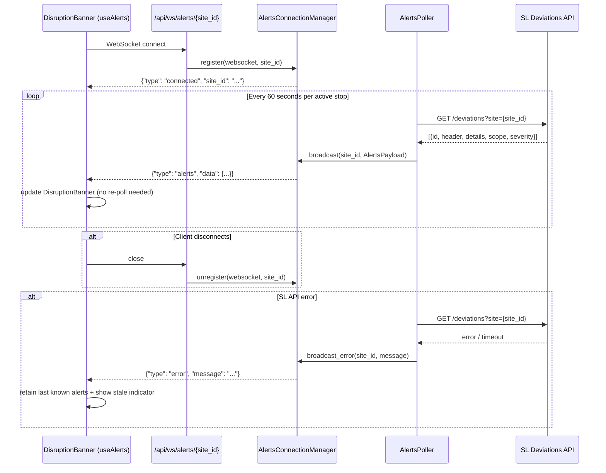
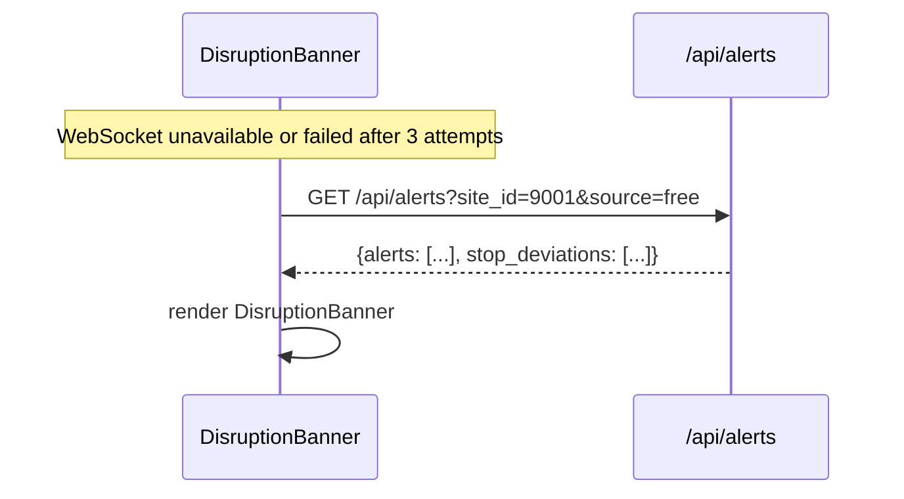
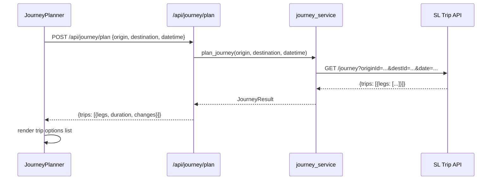
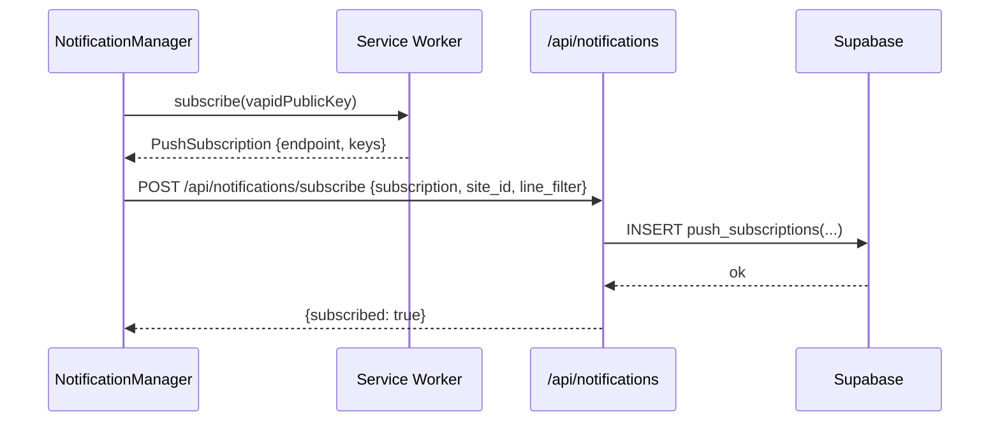
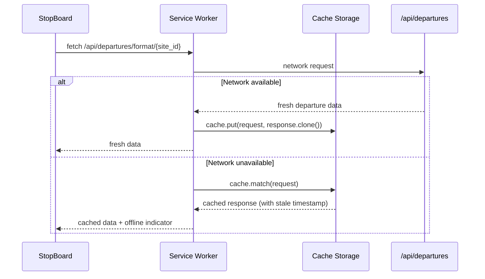

# Design Document: Stockholm Travel Planner Improvements

## Overview

This document covers four improvements for the Stockholm real-time transit webapp: **Disruption Alerts** (with WebSocket live push), **Journey Planning**, **Push Notifications**, and **Offline Support**. Each feature builds on the existing FastAPI + React/TypeScript stack and the SL free-tier Trafiklab APIs already integrated.

The existing architecture (FastAPI backend proxying SL APIs, React frontend with Supabase for favourites, localStorage for recents) is extended rather than replaced. The departure board keeps its existing 30-second REST polling — nothing about that flow changes. WebSocket is used only for disruption alerts: the backend polls the SL Deviations API and pushes alert updates to connected clients in real time, so the `DisruptionBanner` updates without the user having to refresh or wait for a page-level poll.

No new runtime dependencies are introduced on the backend beyond what is already in `requirements.txt`. The frontend adds `workbox-window` for the service worker. WebSocket support uses FastAPI's built-in `fastapi.WebSocket` — no extra packages needed.

---

## Architecture

```mermaid
graph TD
    subgraph Frontend ["Frontend (React + TypeScript + Vite)"]
        UI[App / StopBoard / SearchBar]
        AlertBanner[DisruptionBanner component]
        AlertHook[useAlerts hook - WebSocket]
        JourneyPanel[JourneyPlanner component]
        NotifMgr[NotificationManager hook]
        SW[Service Worker - Workbox]
        Cache[(Cache Storage)]
    end

    subgraph Backend ["Backend (FastAPI + Python)"]
        DeparturesRouter[/api/departures - unchanged]
        AlertsRouter[/api/alerts - REST fallback]
        WsAlertsRouter[/api/ws/alerts - WebSocket]
        JourneyRouter[/api/journey]
        NotifRouter[/api/notifications]
        SLService[sl_api.py - unchanged]
        AlertsService[alerts_service.py - new]
        JourneyService[journey_service.py - new]
        PushService[push_service.py - new]
        AlertsManager[AlertsConnectionManager - new]
        AlertsPoller[alerts_poller.py - new]
    end

    subgraph External ["External"]
        SLFree[SL Free Departures API]
        SLDev[SL Deviations API]
        VAPID[Web Push / VAPID]
        Supabase[(Supabase DB)]
    end

    UI -->|30s REST poll - unchanged| DeparturesRouter
    AlertBanner --> AlertHook
    AlertHook <-->|WebSocket| WsAlertsRouter
    AlertBanner -.->|fallback| AlertsRouter
    JourneyPanel --> JourneyRouter
    NotifMgr --> NotifRouter
    SW --> Cache
    SW --> DeparturesRouter

    DeparturesRouter --> SLService
    AlertsRouter --> AlertsService --> SLDev
    WsAlertsRouter --> AlertsManager
    AlertsPoller -->|poll every 60s| SLDev
    AlertsPoller --> AlertsManager
    AlertsManager -->|broadcast| WsAlertsRouter
    JourneyRouter --> JourneyService --> SLFree
    NotifRouter --> PushService --> VAPID
    NotifRouter --> Supabase
```

---

## Sequence Diagrams

### Disruption Alerts — WebSocket Flow



### Disruption Alerts — REST Fallback Flow



### Journey Planning Flow



### Push Notification Subscription Flow



### Offline Support Flow



---

## Components and Interfaces

### useAlerts (hook)

**Purpose**: Replaces the one-shot `fetch` in `DisruptionBanner` with a WebSocket listener that receives server-pushed alert updates. Falls back to REST polling if WebSocket is unavailable.

**Interface**:
```typescript
interface UseAlertsOptions {
  siteId: string
  fallbackToPolling?: boolean   // default: true
}

interface UseAlertsReturn {
  alerts: Alert[]
  stopDeviations: Alert[]
  loading: boolean
  error: string | null
  lastUpdated: Date | null
  connectionState: 'connecting' | 'connected' | 'disconnected' | 'error'
}

function useAlerts(options: UseAlertsOptions): UseAlertsReturn
```

**Responsibilities**:
- Opens a WebSocket to `ws[s]://{host}/api/ws/alerts/{siteId}` on mount
- Parses incoming `{"type": "alerts", "data": AlertsPayload}` messages and updates state
- On `{"type": "error", ...}`, sets `error` state but retains last known alerts
- Reconnects with exponential back-off (1s → 2s → 4s → max 30s) on unexpected close
- Falls back to 60s REST polling after 3 failed reconnect attempts
- Closes the WebSocket and cancels any polling timer on unmount or `siteId` change

---

### DisruptionBanner

**Purpose**: Displays active service disruptions for the currently selected stop inline above the departure board.

**Interface**:
```typescript
interface DisruptionBannerProps {
  siteId: string
  source?: 'free' | 'key'
}

interface Alert {
  id: string
  header: string
  details: string
  severity: 'info' | 'warning' | 'critical'
  scope: string[]          // affected line numbers
  transport_mode?: string
  valid_from?: string
  valid_to?: string
}

interface AlertsResponse {
  alerts: Alert[]
  stop_deviations: Alert[]
}
```

**Responsibilities**:
- Uses `useAlerts` hook internally; hidden when `alerts.length === 0`
- Colour-codes by severity (info → blue, warning → amber, critical → red)
- Shows a "Live" badge when WebSocket is connected; "Updating..." when reconnecting
- Does not block the departure board render

---

### JourneyPlanner

**Purpose**: Lets the user enter an origin and destination stop and see a list of trip options with legs, durations, and transfer counts.

**Interface**:
```typescript
interface JourneyPlannerProps {
  initialOrigin?: Site
  onStopSelect: (site: Site) => void
}

interface JourneyLeg {
  origin: string
  destination: string
  departure_time: string
  arrival_time: string
  line_number: string
  transport_mode: string
  direction: string
}

interface Trip {
  duration_minutes: number
  changes: number
  legs: JourneyLeg[]
  departure_time: string
  arrival_time: string
}

interface JourneyResult {
  trips: Trip[]
  origin_name: string
  destination_name: string
}
```

**Responsibilities**:
- Provides two `SearchBar`-style inputs (origin, destination) with autocomplete
- Sends a `POST /api/journey/plan` request
- Renders up to 5 trip options sorted by departure time
- Each trip is expandable to show individual legs

---

### NotificationManager (hook)

**Purpose**: Manages Web Push subscription lifecycle.

**Interface**:
```typescript
interface UseNotificationsReturn {
  supported: boolean
  permission: NotificationPermission
  subscribed: boolean
  subscribe: (siteId: string, lineFilter?: string[]) => Promise<void>
  unsubscribe: (siteId: string) => Promise<void>
  error: string | null
}

function useNotifications(): UseNotificationsReturn
```

**Responsibilities**:
- Checks `'Notification' in window` and `'serviceWorker' in navigator`
- Calls `registration.pushManager.subscribe({ userVisibleOnly: true, applicationServerKey: VAPID_PUBLIC_KEY })`
- POSTs the resulting `PushSubscription` JSON to `/api/notifications/subscribe`
- Persists subscription state in `localStorage` to avoid re-subscribing on every mount

---

### Service Worker (Workbox)

**Purpose**: Provides offline caching for departure data and static assets.

**Responsibilities**:
- Precaches app shell (HTML, CSS, JS bundles) using Workbox `precacheAndRoute`
- Runtime caches `/api/departures/**` with a `NetworkFirst` strategy, 30s timeout, falling back to cache
- Runtime caches `/api/alerts/**` with a `StaleWhileRevalidate` strategy
- Adds an `X-Served-By: service-worker` header to cached responses so the UI can show an offline indicator
- Handles push events: shows a notification with title/body from the push payload

---

### AlertsConnectionManager (backend)

**Purpose**: Tracks all active WebSocket connections grouped by `site_id` and broadcasts alert payloads to the correct subscribers.

**Interface**:
```python
class AlertsConnectionManager:
    async def connect(self, websocket: WebSocket, site_id: str) -> None
    async def disconnect(self, websocket: WebSocket, site_id: str) -> None
    async def broadcast(self, site_id: str, data: dict) -> None
    def subscriber_count(self, site_id: str) -> int
    def active_site_ids(self) -> set[str]
```

**Responsibilities**:
- Maintains `dict[str, set[WebSocket]]` mapping `site_id` → connected sockets
- `broadcast` sends JSON to all sockets for a site; silently removes any socket that raises `WebSocketDisconnect` during send
- Exposes `active_site_ids()` so the poller knows which stops to poll

---

### AlertsPoller (backend)

**Purpose**: Background `asyncio` task that polls the SL Deviations API every 60 seconds for each stop that has at least one active WebSocket subscriber, then broadcasts via `AlertsConnectionManager`.

**Interface**:
```python
class AlertsPoller:
    def __init__(self, manager: AlertsConnectionManager, interval: int = 60) -> None
    async def start(self) -> None
    async def stop(self) -> None
```

**Responsibilities**:
- On each tick, calls `manager.active_site_ids()` to get the current subscriber set
- Fetches alerts for each active stop concurrently using `asyncio.gather`
- On success: broadcasts `{"type": "alerts", "site_id": ..., "data": AlertsPayload, "timestamp": ...}`
- On SL API error: broadcasts `{"type": "error", "site_id": ..., "message": ...}`
- Stops polling a site automatically when `manager.subscriber_count(site_id) == 0`
- Does not start a new poll cycle until the previous one completes

---

## Data Models

### Alert

```typescript
interface Alert {
  id: string
  header: string
  details: string
  severity: 'info' | 'warning' | 'critical'
  scope: string[]
  transport_mode?: string
  valid_from?: string      // ISO 8601
  valid_to?: string        // ISO 8601
}
```

**Validation Rules**:
- `severity` is one of the three enum values; defaults to `'info'` when unmapped
- `scope` may be empty (means stop-wide disruption)

---

### WebSocket Alert Message Protocol

```typescript
// Server → Client messages
interface WsConnectedMessage {
  type: 'connected'
  site_id: string
}

interface WsAlertsMessage {
  type: 'alerts'
  site_id: string
  data: {
    alerts: Alert[]
    stop_deviations: Alert[]
  }
  timestamp: string         // ISO 8601 server time
}

interface WsErrorMessage {
  type: 'error'
  site_id: string
  message: string
}

type WsServerMessage = WsConnectedMessage | WsAlertsMessage | WsErrorMessage
```

---

### JourneyRequest / JourneyResult

```typescript
interface JourneyRequest {
  origin_id: string
  destination_id: string
  datetime?: string        // ISO 8601, defaults to now
  max_changes?: number     // 0–5, default 3
}

interface JourneyResult {
  trips: Trip[]
  origin_name: string
  destination_name: string
}
```

**Validation Rules**:
- `origin_id` and `destination_id` must be non-empty and different
- `max_changes` clamped to [0, 5]

---

### PushSubscription (Supabase)

```sql
CREATE TABLE push_subscriptions (
  id          UUID PRIMARY KEY DEFAULT gen_random_uuid(),
  endpoint    TEXT NOT NULL UNIQUE,
  p256dh      TEXT NOT NULL,
  auth        TEXT NOT NULL,
  site_id     TEXT NOT NULL,
  line_filter TEXT[],
  created_at  TIMESTAMPTZ DEFAULT now(),
  updated_at  TIMESTAMPTZ DEFAULT now()
);
```

---

## Algorithmic Pseudocode

### Alert Severity Mapping

```pascal
FUNCTION map_severity(raw_severity: string) -> AlertSeverity
  lower ← raw_severity.lower()
  IF lower IN {'critical', 'high', 'severe', 'major'} THEN RETURN 'critical'
  ELSE IF lower IN {'warning', 'medium', 'moderate'} THEN RETURN 'warning'
  ELSE RETURN 'info'
END FUNCTION
```

**Postconditions**: always returns a valid `AlertSeverity`; never raises

---

### useAlerts WebSocket Lifecycle (Frontend)

```pascal
PROCEDURE useAlerts(siteId: string)
  attempts ← 0
  backoff  ← 1s

  PROCEDURE connect()
    connectionState ← 'connecting'
    ws ← new WebSocket(`ws://{host}/api/ws/alerts/{siteId}`)

    ws.onopen ← () =>
      connectionState ← 'connected'; attempts ← 0; backoff ← 1s

    ws.onmessage ← (event) =>
      msg ← JSON.parse(event.data)
      IF msg.type = 'alerts' THEN
        alerts ← msg.data.alerts
        stopDeviations ← msg.data.stop_deviations
        lastUpdated ← new Date(msg.timestamp)
        error ← null
      ELSE IF msg.type = 'error' THEN
        error ← msg.message   // retain stale alerts

    ws.onclose ← () =>
      connectionState ← 'disconnected'
      IF attempts < 3 THEN
        attempts++; schedule(connect, backoff); backoff ← min(backoff * 2, 30s)
      ELSE
        startRestPolling(siteId, interval=60s)
  END PROCEDURE

  connect()
  ON UNMOUNT OR siteId CHANGE: ws.close(); stopRestPolling()
END PROCEDURE
```

---

### AlertsPoller Tick (Backend)

```pascal
PROCEDURE poller_tick(manager, client)
  site_ids ← manager.active_site_ids()
  IF site_ids IS EMPTY THEN RETURN

  results ← await asyncio.gather(
    fetch_alerts_for_site(site_id, client) FOR each site_id,
    return_exceptions=True
  )

  FOR each (site_id, result) IN zip(site_ids, results) DO
    IF result IS Exception THEN
      await manager.broadcast(site_id, {type:'error', site_id, message:str(result)})
    ELSE
      await manager.broadcast(site_id, {type:'alerts', site_id, data:result, timestamp:utcnow()})
  END FOR
END PROCEDURE
```

---

### Journey Leg Normalisation

```pascal
FUNCTION normalize_leg(raw_leg: dict) -> JourneyLeg
  origin      ← raw_leg.get('Origin', {})
  destination ← raw_leg.get('Destination', {})
  product     ← raw_leg.get('Product', {})
  RETURN JourneyLeg {
    origin: origin.get('name',''), destination: destination.get('name',''),
    departure_time: origin.get('time',''), arrival_time: destination.get('time',''),
    line_number: product.get('num',''), transport_mode: product.get('catOut','').lower(),
    direction: raw_leg.get('direction','')
  }
END FUNCTION
```

---

### Push Notification Dispatch

```pascal
PROCEDURE dispatch_push_notifications(site_id, departure)
  subscriptions ← db.query("SELECT * FROM push_subscriptions WHERE site_id = $1", [site_id])
  FOR each sub IN subscriptions DO
    IF sub.line_filter IS EMPTY OR departure.line_number IN sub.line_filter THEN
      TRY
        webpush(sub, json(build_push_payload(departure)), VAPID_PRIVATE_KEY)
      CATCH WebPushException AS e
        IF e.response.status_code = 410 THEN db.delete(sub)
        LOG e
      END TRY
    END IF
  END FOR
END PROCEDURE
```

---

### Service Worker Cache Strategy

```pascal
PROCEDURE handle_fetch(event)
  url ← event.request.url
  IF url MATCHES '/api/departures/**' THEN
    TRY
      response ← await network_fetch(event.request, timeout=30s)
      cache.put(event.request, response.clone())
      RETURN response
    CATCH TimeoutError OR NetworkError
      cached ← await cache.match(event.request)
      RETURN cached IS NOT NULL
        ? add_header(cached, 'X-Served-By', 'service-worker')
        : offline_response()
  ELSE IF url MATCHES '/api/alerts/**' THEN
    cached ← await cache.match(event.request)
    network_promise ← network_fetch(event.request).then(r => cache.put(...))
    RETURN cached ?? await network_promise
  ELSE
    RETURN await precache_handler(event.request)
  END IF
END PROCEDURE
```

---

## Key Functions with Formal Specifications

### `fetch_alerts_for_site(site_id, source)`

```python
async def fetch_alerts_for_site(
    site_id: int,
    source: str = "free",
    *,
    client: Optional[httpx.AsyncClient] = None,
) -> AlertsResponse:
```

**Preconditions**: `site_id` is a positive integer; `source` is `'free'` or `'key'`
**Postconditions**: returns `AlertsResponse` (may be empty); never raises; all `Alert.severity` values are valid

---

### `AlertsConnectionManager.broadcast(site_id, data)`

```python
async def broadcast(self, site_id: str, data: dict) -> None:
```

**Preconditions**: `data` has a `type` field
**Postconditions**: all connected sockets for `site_id` receive the JSON payload; any socket raising `WebSocketDisconnect` is removed before the function returns

---

### `plan_journey(origin_id, destination_id, datetime, max_changes)`

```python
async def plan_journey(
    origin_id: str, destination_id: str,
    datetime: Optional[str] = None, max_changes: int = 3,
    *, client: Optional[httpx.AsyncClient] = None,
) -> JourneyResult:
```

**Preconditions**: `origin_id != destination_id`; `max_changes` in [0, 5]
**Postconditions**: `trips` sorted ascending by `departure_time`; each `Trip` has ≥ 1 leg

---

### `subscribe_push(endpoint, p256dh, auth, site_id, line_filter)`

```python
async def subscribe_push(
    endpoint: str, p256dh: str, auth: str,
    site_id: str, line_filter: list[str],
) -> dict:
```

**Preconditions**: `endpoint` is a non-empty HTTPS URL; `site_id` is non-empty
**Postconditions**: upserts one row in `push_subscriptions`; returns `{"subscribed": True}`

---

## Example Usage

```typescript
// Disruption banner — WebSocket-powered
<DisruptionBanner siteId={site.SiteId} source="free" />
// internally uses useAlerts which opens ws://host/api/ws/alerts/{siteId}

// Connection state badge inside DisruptionBanner
{connectionState === 'connected' && <span>Live</span>}
{connectionState === 'disconnected' && <span>Updating...</span>}

// Journey planner
<JourneyPlanner initialOrigin={selectedSite} onStopSelect={handleSiteSelect} />

// Push notifications
const { supported, subscribed, subscribe } = useNotifications()
if (supported && !subscribed) await subscribe(site.SiteId, ['55', '76'])

// Offline indicator (departure board — unchanged)
const isOffline = lastResponse?.headers.get('X-Served-By') === 'service-worker'
{isOffline && <span>Showing cached data</span>}
```

```python
# WebSocket alerts endpoint
@router.websocket("/alerts/{site_id}")
async def ws_alerts(websocket: WebSocket, site_id: str):
    await manager.connect(websocket, site_id)
    try:
        while True:
            await websocket.receive_text()  # keep-alive
    except WebSocketDisconnect:
        await manager.disconnect(websocket, site_id)

# REST fallback
@router.get("/")
async def get_alerts(site_id: int, source: str = "free"):
    return await fetch_alerts_for_site(site_id, source)

# Startup — launch alerts poller
@app.on_event("startup")
async def startup():
    asyncio.create_task(alerts_poller.start())
```

---

## Correctness Properties

- For all `Alert` objects, `severity` is one of `{'info', 'warning', 'critical'}`.
- For all `Trip` objects, `len(trip.legs) >= 1` and `trip.duration_minutes > 0`.
- For all `Trip` lists, trips are sorted ascending by `departure_time`.
- For all push dispatch calls, a subscription with HTTP 410 response is removed from the database before the function returns.
- For all service worker fetch events matching `/api/departures/**`, the handler always resolves (never rejects to the page).
- For all `subscribe_push` calls with the same `endpoint`, the database contains exactly one row after the call (upsert semantics).
- For all `AlertsConnectionManager.broadcast` calls, any socket raising `WebSocketDisconnect` is removed from the active set before the function returns.
- For all `AlertsPoller` ticks, every `site_id` with `subscriber_count > 0` receives exactly one broadcast per tick.
- For all `useAlerts` instances, when the component unmounts or `siteId` changes, the WebSocket is closed and any polling fallback timer is cancelled.

---

## Error Handling

### Disruption Alerts: SL API Unavailable

**Condition**: `fetch_alerts_for_site` raises `SLApiError`
**Response**: returns `AlertsResponse(alerts=[], stop_deviations=[], status='error')`; poller broadcasts `{"type": "error", ...}`
**Recovery**: `DisruptionBanner` retains last known alerts and shows a stale indicator; departure board unaffected

### Disruption Alerts: WebSocket Unavailable

**Condition**: WebSocket connection fails after 3 reconnect attempts
**Response**: `useAlerts` falls back to 60s REST polling via `GET /api/alerts`
**Recovery**: Reverts to WebSocket automatically if the connection recovers

### Journey Planning: No Routes Found

**Condition**: SL Trip API returns empty `trips` or non-200
**Response**: `plan_journey` returns `JourneyResult(trips=[])` without raising
**Recovery**: `JourneyPlanner` shows "No routes found" with a retry button

### Push: Expired Subscription (HTTP 410)

**Condition**: `webpush()` receives 410 Gone
**Response**: subscription row deleted from Supabase; error logged
**Recovery**: `useNotifications` prompts re-subscribe on next visit

### Offline: No Cached Data

**Condition**: Network unavailable and no cache entry exists
**Response**: service worker returns `{"offline": true, "buses": []}`
**Recovery**: UI shows "Offline — no cached data" with a retry button

---

## Testing Strategy

### Unit Testing

- `map_severity`: all known SL severity strings; unknown strings default to `'info'`
- `normalize_leg`: complete raw leg, missing keys, empty dict
- `fetch_alerts_for_site`: mock SL deviations endpoint; ok, error, empty list
- `plan_journey`: mock `httpx.AsyncClient`; empty trips, single trip, multi-leg
- `subscribe_push`: mock Supabase; insert, upsert on duplicate endpoint
- `AlertsConnectionManager.broadcast`: multiple sockets; disconnected socket removed; empty set is no-op
- `AlertsPoller` tick: all active sites receive broadcast; SL error triggers error broadcast; empty set skips all fetches
- `useAlerts` hook: mock WebSocket; state transitions on connect/message/close; reconnect back-off; fallback to polling after 3 failures; cleanup on unmount

### Property-Based Testing

- For any string input to `map_severity`, output is always one of `{'info', 'warning', 'critical'}`
- For any `Trip` list from `plan_journey`, list is sorted by `departure_time`
- For any `JourneyLeg` from `normalize_leg` with arbitrary dict input, all string fields are non-null
- For any sequence of `connect`/`disconnect` calls on `AlertsConnectionManager`, `subscriber_count` is always ≥ 0 and `active_site_ids` never contains a site with zero subscribers
- For any `WsAlertsMessage` received by `useAlerts`, the resulting state equals `message.data` (no mutation)

### Integration Testing

- `GET /api/alerts?site_id=9001&source=free` returns 200 with `alerts` array
- `POST /api/journey/plan` with valid origin/destination returns 200 with `trips` array
- `POST /api/notifications/subscribe` inserts a row in Supabase and returns `{"subscribed": true}`
- WebSocket: connect to `ws://localhost:8000/api/ws/alerts/{site_id}`, verify `connected` message, wait for first `alerts` message within 65s, verify shape
- Service worker: Playwright test disables network, verifies departure board shows cached data with offline badge

---

## Performance Considerations

- Alerts poller runs every 60s (not 30s) — disruption data changes less frequently than departures
- One SL Deviations API call per active stop per tick regardless of subscriber count
- Departure board REST polling is unchanged — no regression to existing behaviour
- WebSocket connections are lightweight; uvicorn handles hundreds of concurrent connections without config changes

---

## Security Considerations

- VAPID keys stored as environment variables; never committed to source
- Push subscription endpoints stored in Supabase with row-level security
- Journey planning validates `origin_id != destination_id` and clamps `max_changes`
- Service worker only caches responses from the app's own origin
- WebSocket `site_id` path parameter validated as non-empty string; malformed IDs rejected with 400 close code
- Alert WebSocket connections accepted under the same CORS policy as REST endpoints; departure data is public

---

## Dependencies

### New Backend Dependencies

- `pywebpush` — Web Push / VAPID push messages
- `py-vapid` — VAPID key signing (pulled in by `pywebpush`)
- No new dependencies for WebSocket — `fastapi.WebSocket` is built into FastAPI/uvicorn

### New Frontend Dependencies

- `vite-plugin-pwa` — service worker via Workbox
- `workbox-window` — service worker registration helper
- No new dependencies for WebSocket — browser-native `WebSocket` API used directly

### Existing Dependencies (unchanged)

- FastAPI, httpx, Supabase JS client, React, TypeScript, Vite
