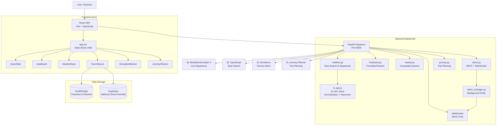
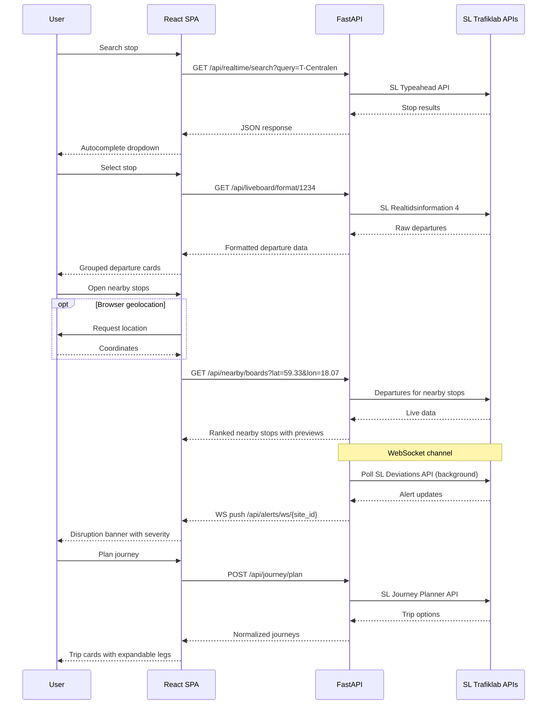
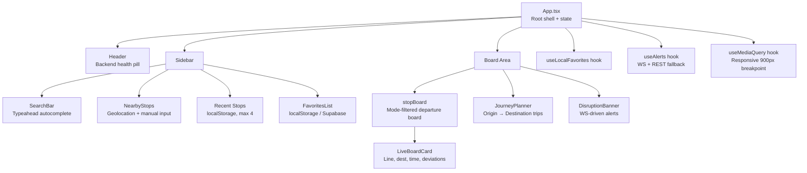
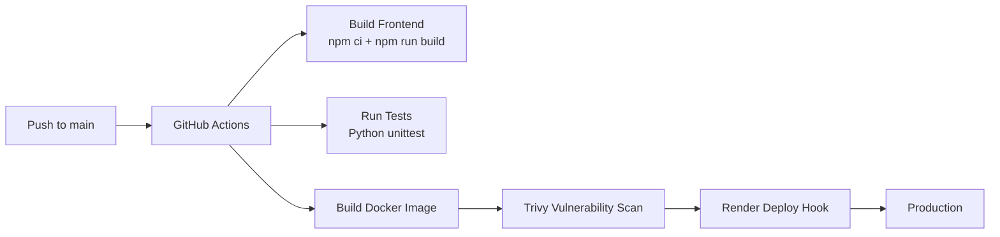

# Stockholm Travel Planner

**Real-time public transport information for Stockholm — live departure boards, nearby stops, service alerts, and journey planning across all SL transport modes.**

A full-stack application connecting Stockholm's public transit data (SL Trafiklab APIs) to a responsive dark-theme dashboard. Built with React + TypeScript on the frontend and Python FastAPI on the backend, containerized with Docker, and deployed via CI/CD.

---

## Architecture

### System Overview



### Data Flow



### Frontend Component Tree



---

## Tech Stack

| Category | Technology | Purpose |
|---|---|---|
| **Frontend** | React 18 + TypeScript | Component-based UI with type safety |
| **Build** | Vite 5 | Fast HMR dev server, optimized production builds |
| **Backend** | Python 3.11+ / FastAPI | Async API server with automatic OpenAPI docs |
| **API Client** | httpx | Async HTTP client for upstream SL API calls |
| **Validation** | Pydantic | Request/response schema validation |
| **Database** | Supabase (PostgreSQL) | Optional cloud favorites persistence |
| **Container** | Docker (multi-stage) | Node build → Python runtime image |
| **CI/CD** | GitHub Actions | Build, test, scan (Trivy), deploy (Render) |

### Key Design Decisions

- **No React Router** — The app uses state-driven conditional rendering in `App.tsx` rather than URL-based routing, keeping the bundle minimal for a single-view tool.
- **No CSS framework** — All styles are inline `React.CSSProperties` objects. This avoids a CSS dependency and keeps the dark-theme styling self-contained.
- **Graceful degradation** — Supabase is optional; the app works entirely offline-first with localStorage. WebSocket alerts fall back to REST polling with exponential backoff after 3 failed connection attempts.
- **Dual SL API modes** — Supports both "key" (Trafiklab API key) and "free" (open endpoints) via `?source=free|key`, enabling development without paid credentials.

---

## Features

### Live Departure Boards
Real-time departures grouped by transport mode (Bus, Metro, Train, Tram, Ship). Each card shows line number, destination, scheduled/expected time, and deviation status. Auto-refreshes every 30 seconds with manual refresh always available.

### Stop Search with Typeahead
Async autocomplete search against SL's stop database. Returns stops with type metadata and site IDs. Recent stops (last 4) persist in localStorage for one-tap re-access.

### Nearby Stops with Live Previews
Browser geolocation or manual text input to find stops ranked by Haversine distance. Each nearby stop shows a live departure preview with mode filtering. Selection loads the full board.

### Journey Planning
Point-to-point trip planner with stop autocomplete for both origin and destination. Returns up to 5 trip options sorted by departure time, with expandable leg details (mode, line, duration, transfers).

### Live Disruption Alerts
Service alerts pushed via WebSocket with severity color-coding:
- **Critical** (red) — Major disruptions
- **Warning** (amber) — Significant delays
- **Info** (blue) — Minor changes / planned work

Backend runs a background asyncio task polling only for stops with active WebSocket subscribers.

### Backend Health Monitoring
Real-time status pill in the header polls `/api/health` every 30 seconds. Green/amber/red indicators let users know if the backend is reachable.

---

## API Reference

| Method | Endpoint | Description |
|---|---|---|
| `GET` | `/api/health` | Backend health check |
| `GET` | `/api/realtime/search?query={text}` | Search stops/stations |
| `GET` | `/api/realtime/liveboard/{site_id}` | Raw departure data |
| `GET` | `/api/liveboard/format/{site_id}` | Formatted departure board |
| `GET` | `/api/nearby/stops?lat={}&lon={}` | Nearby stops ranked by distance |
| `GET` | `/api/nearby/boards?lat={}&lon={}` | Nearby stops with departure previews |
| `GET` | `/api/nearby/train-boards?lat={}&lon={}` | Nearby train/metro stations with previews |
| `GET` | `/api/situations/?site_id={}` | Service alerts (REST) |
| `GET` | `/api/alerts/?site_id={}` | Alerts REST fallback |
| `WS` | `/api/alerts/ws/{site_id}` | Live alert push |
| `POST` | `/api/journey/plan` | Journey planning (JSON body) |

---

## Quick Start

### Prerequisites

- Node.js 18+
- Python 3.11+
- SL API key ([Trafiklab](https://www.trafiklab.se/)) — optional for free mode

### Backend

```bash
cd backend
python -m venv venv && source venv/bin/activate
pip install -r requirements.txt

# Configure (optional — app runs in free mode without a key)
cp .env.example .env
# Edit .env with your SL_REALTIME_API_KEY

uvicorn main:app --reload --port 8000
```

### Frontend

```bash
npm install
npm run dev      # Starts on localhost with API proxy to backend

### Docker

```bash
docker build -t stockholm-travel-planner .
docker run -p 8000:8000 stockholm-travel-planner
```

---

## CI/CD Pipeline



The pipeline in `.github/workflows/ci.yml`:
1. Installs Node dependencies and builds the frontend
2. Runs Python test suite (7 test files)
3. Builds the multi-stage Docker image
4. Scans with Trivy for vulnerabilities
5. Triggers Render deploy hook (only on `main`, only if scan passes)

---

## Project Structure

```
├── backend/
│   ├── main.py                 # FastAPI app, static file serving, health check
│   ├── routers/
│   │   ├── realtime.py         # Stop search + raw departures
│   │   ├── liveboard.py        # Formatted departure boards
│   │   ├── nearby.py           # Geospatial nearby queries
│   │   ├── situations.py       # Service alerts REST
│   │   ├── alerts.py           # Alerts REST + WebSocket endpoint
│   │   └── journey.py          # Journey planning
│   ├── services/
│   │   ├── sl_api.py           # Core SL client, Haversine distance
│   │   ├── sl_config.py        # Configurable API URLs
│   │   ├── alerts_service.py   # Alert normalization
│   │   ├── alerts_manager.py   # WebSocket manager + background poller
│   │   └── journey_service.py  # Trip normalization
│   └── tests/                  # 7 test files (unittest)
├── src/
│   ├── App.tsx                 # Application shell, state, layout
│   ├── main.tsx                # React entry point
│   ├── components/
│   │   ├── SearchBar.tsx       # Stop autocomplete
│   │   ├── stopBoard.tsx       # Live departure board + mode filters
│   │   ├── LiveBoardCard.tsx   # Individual departure card
│   │   ├── NearbyStops.tsx     # Nearby stops panel
│   │   ├── FavoritesList.tsx   # Saved stops
│   │   ├── DisruptionBanner.tsx# Live alerts
│   │   └── JourneyPlanner.tsx  # Trip planner
│   ├── hooks/
│   │   ├── useLocalFavorites.ts# localStorage favorites
│   │   ├── useAlerts.ts        # WebSocket + REST fallback
│   │   └── useMediaQuery.ts    # Responsive breakpoints
│   └── types/index.ts          # TypeScript interfaces
├── Dockerfile                  # Multi-stage build
├── .github/workflows/ci.yml    # CI/CD pipeline
└── supabase/migrations/        # Database schema
```

---

## License

MIT
