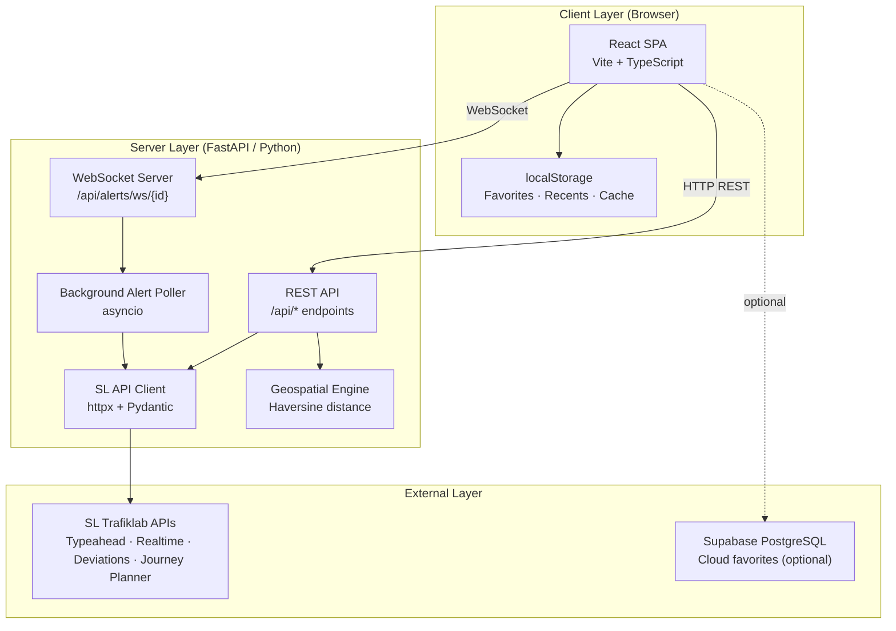
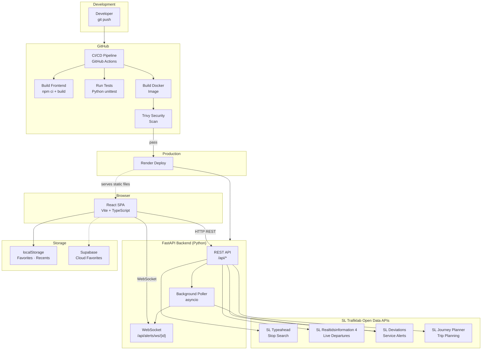
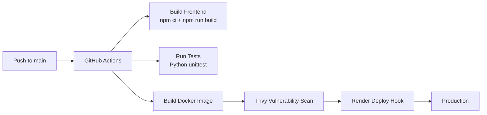

# Stockholm Travel Planner

**Real-time public transport information for Stockholm — live departure boards, nearby stops, service alerts, and journey planning across all SL transport modes.**

A full-stack application connecting Stockholm's public transit data (SL Trafiklab APIs) to a responsive dark-theme dashboard. Built with React + TypeScript on the frontend and Python FastAPI on the backend, containerized with Docker, and deployed via CI/CD.

## System Architecture



**Data flow**: The React SPA communicates with the FastAPI backend via REST for departures, stop search, nearby stops, and journey planning. Live service alerts are pushed from the backend to the browser through a persistent WebSocket connection, fed by a background asyncio poller that fetches only for stops with active subscribers. The backend translates between SL's raw API responses and the frontend's expected schema, handling both key-based and free API modes transparently.

---

## Architecture



High-level flow: **Developer pushes to GitHub → CI/CD builds, tests, scans → deploys to Render → running app serves the React SPA (static) and FastAPI backend → backend proxies requests to SL Trafiklab Open APIs → live alerts pushed via WebSocket to the browser**.

## Tech Stack

| Category | Technology | Purpose |
|---|---|---|
| **Frontend** | React 18 + TypeScript | Component-based UI with type safety |
| **Build** | Vite 5 | Fast HMR dev server, optimized production builds |
| **Backend** | Python 3.11+ / FastAPI | Async API server with automatic OpenAPI docs |
| **API Client** | httpx | Async HTTP client for upstream SL API calls, connection pooling |
| **Validation** | Pydantic / Pydantic-Settings | Request/response validation + type-safe `.env` config |
| **Rate Limiting** | slowapi | Per-endpoint rate limiting (30 req/min) |
| **Database** | Supabase (PostgreSQL) | Optional cloud favorites persistence |
| **Container** | Docker (multi-stage) | Node build → Python runtime image |
| **CI/CD** | GitHub Actions | Build, test, scan (Trivy), deploy (Render) |

## Design Considerations

### Architecture Decisions

- **Backend: Python FastAPI** — Chosen for its native `asyncio` support, which is essential for non-blocking HTTP calls to upstream SL APIs and concurrent WebSocket connections. Automatic OpenAPI docs provide a built-in client for debugging.
- **Frontend: React + TypeScript** — TypeScript catches schema mismatches between SL API responses and the UI at compile time. The component model maps naturally to the card-based departure board UI.
- **WebSocket for alerts** — Service disruptions need real-time push. FastAPI's WebSocket support enables the backend to push filtered alerts only to subscribers of specific stops, avoiding client-side polling overhead.

### State & Data Management

- **No React Router** — The app is a single-view dashboard. State-driven conditional rendering in `App.tsx` keeps the bundle minimal and avoids URL complexity for a tool that has no navigable pages.
- **No CSS framework** — All styles are inline `React.CSSProperties`. This eliminates a CSS dependency, keeps the dark-theme styling self-contained in one codebase, and avoids class-name collisions.
- **localStorage-first persistence** — Favorites and recent stops are stored client-side by default. Supabase cloud sync is an optional opt-in, keeping the core experience dependency-free.

### Resilience & Error Handling

- **Centralized exception handling** — `SLApiError` is caught by global handlers with structured `logger.exception()` logging. Route handlers no longer duplicate try/except blocks. Unhandled exceptions return consistent 500 responses with request context.
- **Graceful degradation** — Every feature has a fallback: WebSocket → REST polling with exponential backoff (3 attempts before giving up); Supabase → localStorage; SL API key → free/open endpoints.
- **Background poller isolation** — The alert poller runs as an independent asyncio task. If it crashes, it restarts without affecting REST endpoints. Subscribers per stop are tracked so the poller only fetches data for actively viewed stops. Exponential backoff (1s → 2s → 4s … 120s cap) prevents thundering-herd on recovery.
- **Health monitoring** — The backend exposes `/api/health`; the frontend polls it every 30 seconds and displays a color-coded indicator, giving immediate visibility into connectivity issues.

### Security

- **API key isolation** — SL API keys are used only server-side via Pydantic Settings (`.env`). The frontend never sees raw keys, preventing client-side exposure. Both key-based and free modes are supported server-side with a simple query parameter switch.
- **Rate limiting** — All REST endpoints are rate-limited to 30 requests/minute per client IP via `slowapi`, protecting upstream SL API quotas.
- **CORS hardening** — Configurable `cors_origins` in settings. Wildcard origins (`*`) automatically disable `allow_credentials` to mitigate CWE-942.
- **No authentication** — The app is intentionally stateless and authentication-free. Favorites are personal (localStorage) or opt-in (Supabase anon key). This eliminates credential management and attack surface.

### Performance

- **Connection pooling** — A shared `httpx.AsyncClient` (20 keepalive connections, 100 max) is created during app lifespan and injected via `Depends()`, avoiding per-request client creation.
- **Selective polling** — The alert manager polls only for stops with active WebSocket subscribers, minimizing upstream API calls and server resource usage.
- **30-second refresh cadence** — Departure boards auto-refresh at 30s, balancing freshness against SL API rate limits. Manual refresh is always available for immediate updates.
- **Minimal bundle** — No router, no CSS framework, no state management library. The frontend ships only what it uses, keeping initial load time low.

---

## Features

### Live Departure Boards
Real-time departures grouped by transport mode (Bus, Metro, Train, Tram, Ship). Each card shows line number, destination, scheduled/expected time, and deviation status. Auto-refreshes every 30 seconds with manual refresh always available.

### Stop Search with Typeahead
Async autocomplete search against SL's stop database. Returns stops with type metadata and site IDs. Recent stops (last 4) persist in localStorage for one-tap re-access.

### Nearby Stops with Live Previews
Browser geolocation or manual text input to find stops ranked by Haversine distance. Each nearby stop shows a live departure preview with mode filtering. Selection loads the full board.

### Journey Planning
Point-to-point trip planner with stop autocomplete for both origin and destination. Returns up to 5 trip options sorted by departure time, with expandable leg details (mode, line, duration, transfers).

### Live Disruption Alerts
Service alerts pushed via WebSocket with severity color-coding:
- **Critical** (red) — Major disruptions
- **Warning** (amber) — Significant delays
- **Info** (blue) — Minor changes / planned work

Backend runs a background asyncio task polling only for stops with active WebSocket subscribers.

### Backend Health Monitoring
Real-time status pill in the header polls `/api/health` every 30 seconds. Green/amber/red indicators let users know if the backend is reachable.

---

## API Reference

| Method | Endpoint | Description |
|---|---|---|
| `GET` | `/api/health` | Backend health check |
| `GET` | `/api/realtime/search?query={text}` | Search stops/stations |
| `GET` | `/api/realtime/liveboard/{site_id}` | Raw departure data |
| `GET` | `/api/liveboard/format/{site_id}` | Formatted departure board |
| `GET` | `/api/nearby/stops?lat={}&lon={}` | Nearby stops ranked by distance |
| `GET` | `/api/nearby/boards?lat={}&lon={}` | Nearby stops with departure previews |
| `GET` | `/api/nearby/train-boards?lat={}&lon={}` | Nearby train/metro stations with previews |
| `GET` | `/api/situations/?site_id={}` | Service alerts (REST) |
| `GET` | `/api/alerts/?site_id={}` | Alerts REST fallback |
| `WS` | `/api/alerts/ws/{site_id}` | Live alert push |
| `POST` | `/api/journey/plan` | Journey planning (JSON body) |

---

## Quick Start

### Prerequisites

- Node.js 18+
- Python 3.11+
- SL API key ([Trafiklab](https://www.trafiklab.se/)) — optional for free mode

### Backend

```bash
cd backend
python -m venv venv && source venv/bin/activate
pip install -r requirements.txt

# Configure (optional — app runs in free mode without a key)
cp .env.example .env
# Edit .env with your SL_REALTIME_API_KEY

# API docs at http://localhost:8000/docs
uvicorn main:app --reload --port 8000
```

### Frontend

```bash
npm install
npm run dev      # Starts on localhost with API proxy to backend

### Docker

```bash
docker build -t stockholm-travel-planner .
docker run -p 8000:8000 stockholm-travel-planner
```

---

## CI/CD Pipeline



The pipeline in `.github/workflows/ci.yml`:
1. Installs Node dependencies and builds the frontend
2. Runs Python test suite (7 test files)
3. Builds the multi-stage Docker image
4. Scans with Trivy for vulnerabilities
5. Triggers Render deploy hook (only on `main`, only if scan passes)

---

## Project Structure

```
├── backend/
│   ├── main.py                 # FastAPI app (lifespan, middleware, exception handlers)
│   ├── routers/
│   │   ├── realtime.py         # Stop search + raw departures
│   │   ├── liveboard.py        # Formatted departure boards
│   │   ├── nearby.py           # Geospatial nearby queries
│   │   ├── situations.py       # Service alerts REST
│   │   ├── alerts.py           # Alerts REST + WebSocket endpoint
│   │   └── journey.py          # Journey planning
│   ├── services/
│   │   ├── config.py           # Pydantic Settings (`.env` loading, all config)
│   │   ├── dependencies.py     # FastAPI DI (get_http_client, limiter)
│   │   ├── schemas.py          # Pydantic response models for every endpoint
│   │   ├── exceptions.py       # SLApiError definition
│   │   ├── sl_api.py           # Core SL HTTP client, Haversine distance, normalizers
│   │   ├── sl_config.py        # Configurable API URLs (wraps config.py)
│   │   ├── alerts_service.py   # Alert normalization
│   │   ├── alerts_manager.py   # WebSocket manager + background poller (exponential backoff)
│   │   └── journey_service.py  # Trip normalization
│   └── tests/
│       ├── test_*.py           # 7 test files (unittest, 68 tests)
│       └── scripts/            # Standalone smoke-test scripts
├── src/
│   ├── App.tsx                 # Application shell, state, layout
│   ├── main.tsx                # React entry point
│   ├── components/
│   │   ├── SearchBar.tsx       # Stop autocomplete
│   │   ├── stopBoard.tsx       # Live departure board + mode filters
│   │   ├── LiveBoardCard.tsx   # Individual departure card
│   │   ├── NearbyStops.tsx     # Nearby stops panel
│   │   ├── FavoritesList.tsx   # Saved stops
│   │   ├── DisruptionBanner.tsx# Live alerts
│   │   └── JourneyPlanner.tsx  # Trip planner
│   ├── hooks/
│   │   ├── useLocalFavorites.ts# localStorage favorites
│   │   ├── useAlerts.ts        # WebSocket + REST fallback
│   │   └── useMediaQuery.ts    # Responsive breakpoints
│   └── types/index.ts          # TypeScript interfaces
├── Dockerfile                  # Multi-stage build
├── .github/workflows/ci.yml    # CI/CD pipeline
└── supabase/migrations/        # Database schema
```

---

## License

MIT
